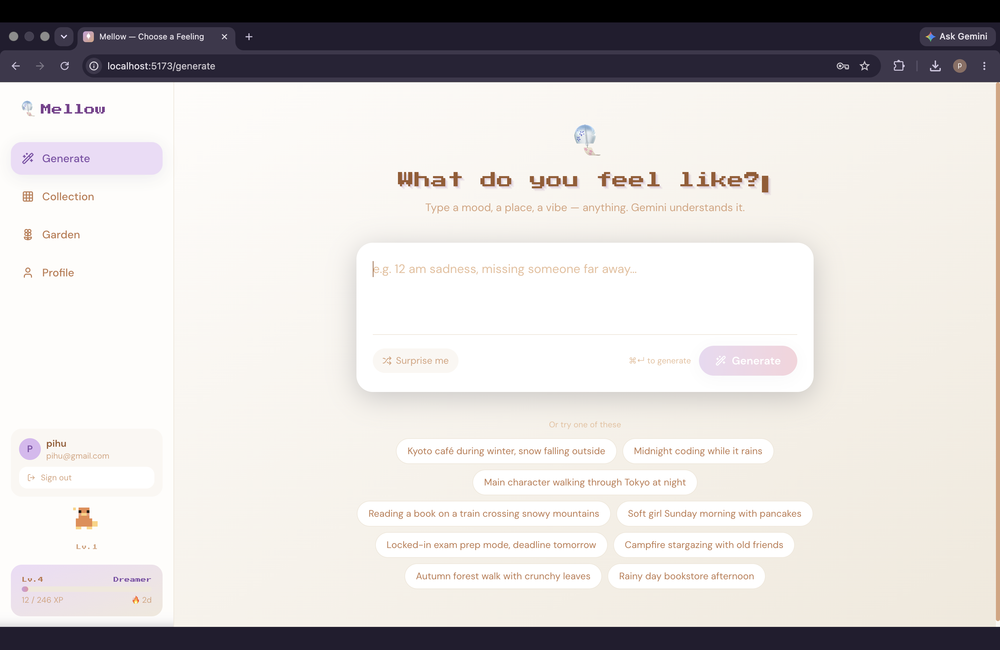
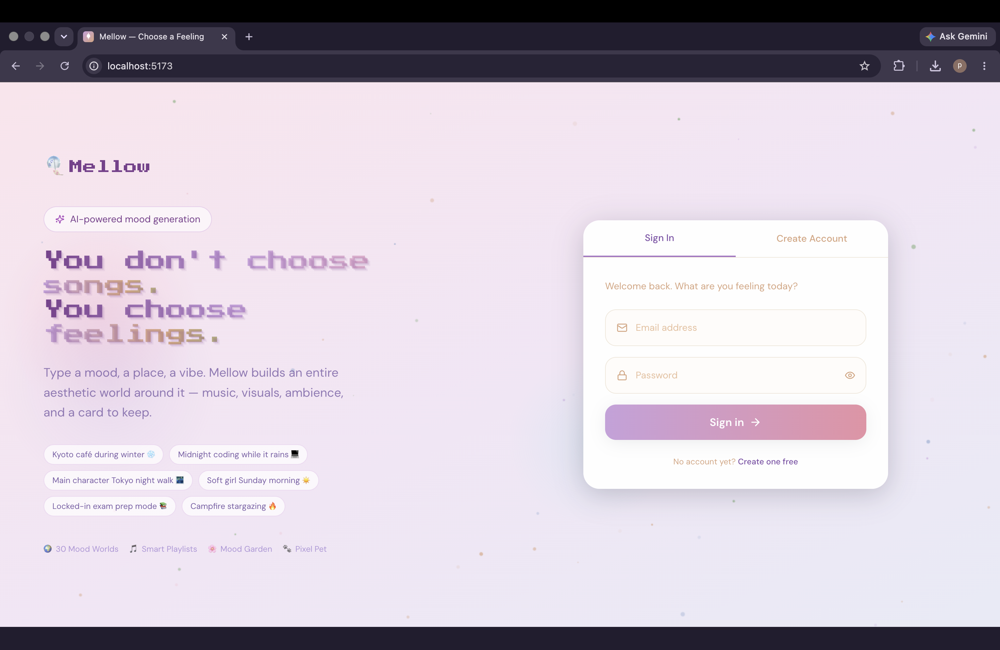
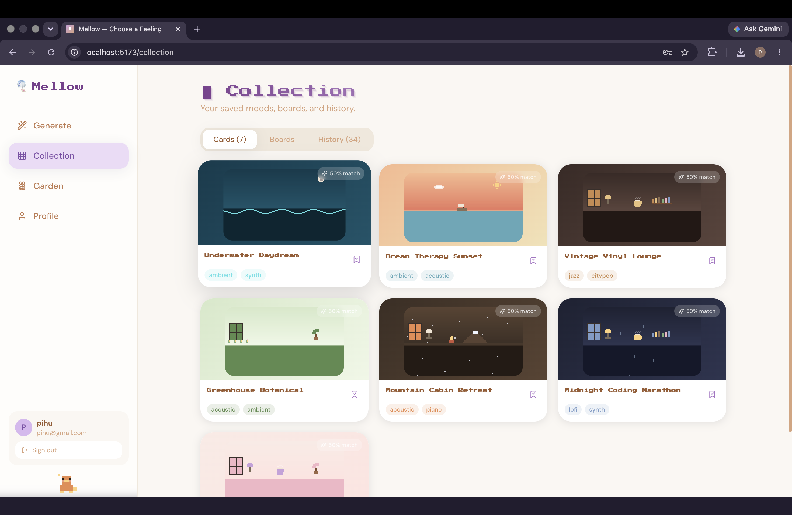
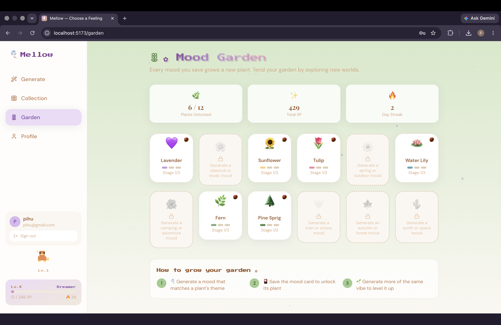
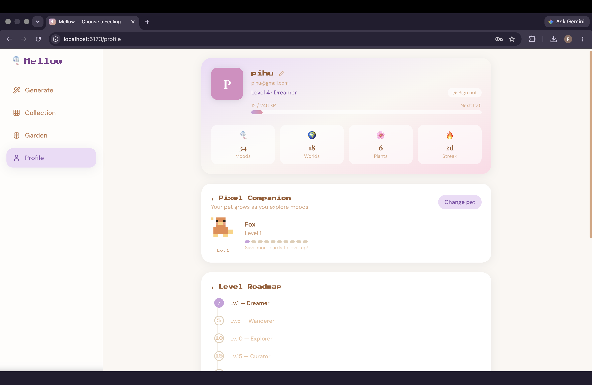
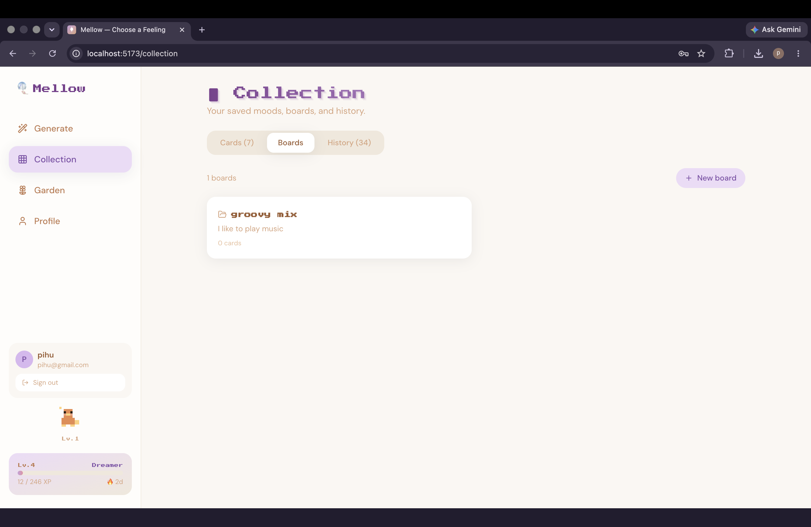

# Mellow

> **You don't choose songs. You choose feelings.**

Mellow is a full-stack AI-powered mood generation platform that creates immersive aesthetic experiences. Type a feeling, a place, or a vibe — and Mellow builds an entire world around it: a curated music playlist, an animated pixel-art scene, layered ambient sounds, a collectible mood card, and a gamified progression system.



---

## Screenshots

| | |
|---|---|
|  |  |
|  |  |
|  |  |

---

## Features

| Feature | Description |
|---|---|
| **Mood Generator** | Natural-language prompt maps to the best of 30 curated Mood Worlds via keyword scoring or Gemini AI |
| **30 Pixel Worlds** | Each world has a unique animated pixel-art scene, colour palette, and metadata |
| **Smart Playlists** | Content-based filtering using cosine similarity on 5 audio features (Energy, Valence, Acousticness, Danceability, Instrumentalness) |
| **Ambient Mixer** | Layer rain, fireplace, cafe chatter, vinyl crackle, and more |
| **Collectible Cards** | Every mood becomes a shareable card with stats, playlist, and quote |
| **Mood Garden** | Save cards to unlock and grow 12 plant species |
| **Pixel Pet** | Choose a Cat, Bunny, Fox, Capybara, or Penguin — evolves as you gain XP |
| **Gamification** | XP system, Levels 1–100, daily streaks, and level titles from Dreamer to Universe Creator |
| **Boards** | Pinterest-style organisation of saved mood cards |

---

## Quick Start

### Prerequisites

- Node.js >= 18
- npm >= 9

### 1 — Install dependencies

```bash
npm install
```

### 2 — Start both client and server

```bash
npm run dev
```

| Service | URL |
|---|---|
| Frontend (Vite) | http://localhost:5173 |
| Backend (Express) | http://localhost:3001 |

No API keys are required. Everything runs out of the box using bundled static datasets. The app is fully offline-capable.

---

## Project Structure

```
mellow/
├── client/                     # React + TypeScript + Tailwind frontend
│   ├── src/
│   │   ├── components/
│   │   │   ├── layout/         # Layout, sidebar, nav
│   │   │   ├── mood/           # MoodCard, ParticleField
│   │   │   ├── world/          # PixelWorld canvas renderer
│   │   │   ├── ambient/        # AmbientMixer
│   │   │   └── gamification/   # PetCompanion, XpToast
│   │   ├── pages/              # LandingPage, GeneratePage, MoodPage, Garden, Collect, Profile
│   │   ├── store/              # Zustand global state
│   │   ├── lib/                # Recommendation engine, utilities
│   │   ├── types/              # TypeScript types, XP logic
│   │   └── data/               # Static JSON datasets
│   └── public/                 # Favicon, static assets
│
├── server/                     # Node.js + Express backend
│   └── src/
│       ├── routes/             # mood.js, user.js, cards.js
│       ├── lib/                # recommender.js, gemini.js, itunes.js, spotify.js
│       └── db/                 # mongo.js (Mongoose schemas)
│
└── data/                       # Source datasets
    ├── moodWorlds.json          # 30 mood worlds with full metadata
    ├── songs.json               # 90 tracks with audio feature vectors
    └── quotes.json              # 40 mood-tagged quotes
```

---

## Recommendation Engine

Mellow's playlist engine uses content-based filtering with no external API dependency.

### Pipeline

```
User prompt
    |
    v
Tokenise + remove stop words
    |
    v
Score each MoodWorld
  - keyword overlap (weight x2)
  - emotion / activity / setting / weather tag overlap (weight x1)
  - Jaccard-style normalisation → 0–1 match score
    |
    v
Select best MoodWorld
    |
    v
Build target audio-feature vector
  - 5 features: energy, danceability, valence, acousticness, instrumentalness
  - Blend: 65% primary genre + 35% secondary genre targets
    |
    v
Score each song via cosine similarity
  - Genre bonus +0.05 if song matches world's primary or secondary genre
    |
    v
Return top-K songs sorted by similarity score
```

### Audio Features

| Feature | Range | Meaning |
|---|---|---|
| Energy | 0–1 | Intensity and activity |
| Danceability | 0–1 | How suitable for dancing |
| Valence | 0–1 | Musical positivity |
| Acousticness | 0–1 | Likelihood of being acoustic |
| Instrumentalness | 0–1 | Predicts absence of vocals |

---

## API Reference

### POST `/api/mood/generate`
```json
{ "prompt": "midnight coding while it rains", "playlistSize": 6 }
```
Returns a full `MoodCard` object.

### GET `/api/mood/worlds`
Returns a summary of all 30 mood worlds.

### GET `/api/mood/worlds/:id`
Returns full world data and 4 related worlds.

### GET `/api/mood/explore?genre=lofi&energy=low`
Filter worlds by genre or energy level.

### POST `/api/user`
Upsert a user profile.

### PATCH `/api/user/:id`
Patch specific profile fields.

### POST `/api/cards`
Save a mood card.

---

## Mood Garden — Plant Unlock Mapping


| Plant | Unlocked By |
|---|---|
| Lavender | Lo-fi / calm moods |
| Cherry Blossom | Classical / study moods |
| Sunflower | Jazz / rainy moods |
| Tulip | Soft / morning moods |
| Daisy | Spring / outdoor moods |
| Water Lily | Ocean / ambient moods |
| Wildflower | Camping / adventure moods |
| Fern | Stormy / greenhouse moods |
| Pine Sprig | Cabin / arctic moods |
| White Orchid | Train / snowy moods |
| Maple Leaf | Autumn / forest moods |
| Neon Cactus | Synth / space moods |

---

## Gamification — XP and Levels


| Action | XP Earned |
|---|---|
| Generate a mood | +10 XP |
| Save a card | +5 XP |
| Unlock a garden plant | +8 XP |
| Daily streak | +3 per streak day |

| Level | Title |
|---|---|
| 1 | Dreamer |
| 5 | Wanderer |
| 10 | Explorer |
| 15 | Curator |
| 20 | Storyteller |
| 30 | Realm Builder |
| 50 | Mood Architect |
| 75 | Dimension Keeper |
| 100 | Universe Creator |

---

## Optional Integrations

Add the following to `server/.env` to enhance the experience:

```env
# AI-powered mood analysis (replaces keyword matching)
GEMINI_API_KEY=...

# Real Spotify track previews (see note on preview availability)
SPOTIFY_CLIENT_ID=...
SPOTIFY_CLIENT_SECRET=...

# Persistent database
MONGO_URI=mongodb+srv://...
```

---

## Development Roadmap

### MVP (This Release)
- [x] 30 mood worlds with full metadata
- [x] Cosine-similarity playlist engine
- [x] Animated pixel-art world renderer
- [x] Mood card generation and collection
- [x] Ambient sound mixer UI
- [x] Mood Garden with 12 plants
- [x] Pixel pet (5 species, evolution stages)
- [x] XP, levelling, and daily streaks
- [x] Boards (Pinterest-style)
- [x] Full Express REST API

### Phase 2
- [ ] Gemini API for richer semantic mood analysis
- [ ] Audio playback with Web Audio API (real ambient synthesis)
- [ ] JWT authentication and Google OAuth
- [ ] MongoDB persistence
- [ ] PWA and offline support

### Phase 3
- [ ] Social features (follow users, trending moods)
- [ ] Community mood challenges
- [ ] Shareable mood streak cards (OG image generation)
- [ ] iOS and Android app (React Native)

---

## Tech Stack

| Layer | Technologies |
|---|---|
| Frontend | React, TypeScript, Tailwind CSS, Framer Motion, Zustand |
| Backend | Node.js, Express |
| Recommendation | Cosine similarity, keyword scoring, Gemini AI (optional) |
| Music | iTunes Search API, Spotify Web API (optional), static fallback |
| Database | MongoDB + Mongoose (optional) |
| Tooling | Vite, ESLint, PostCSS |

---

## License

MIT — use freely, credit appreciated.
